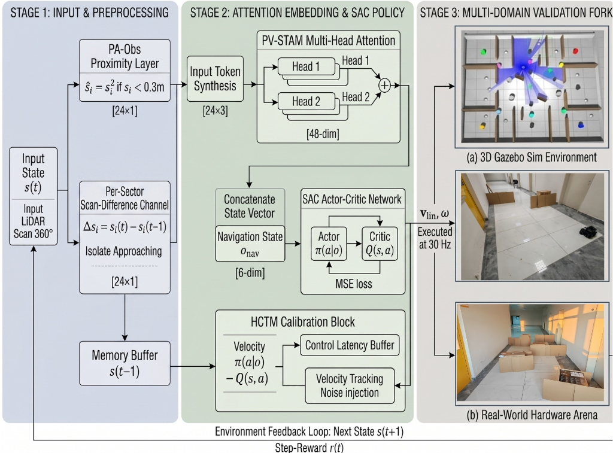
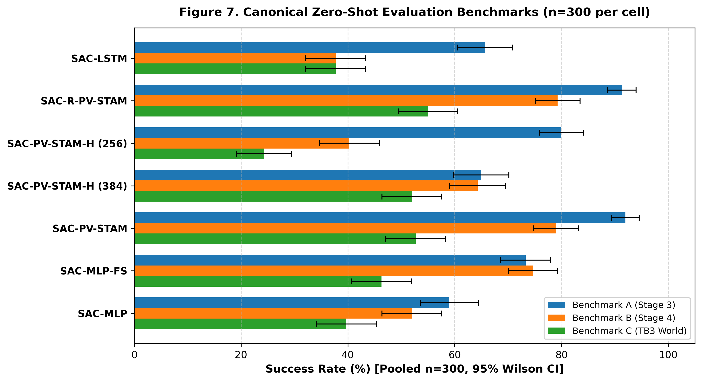
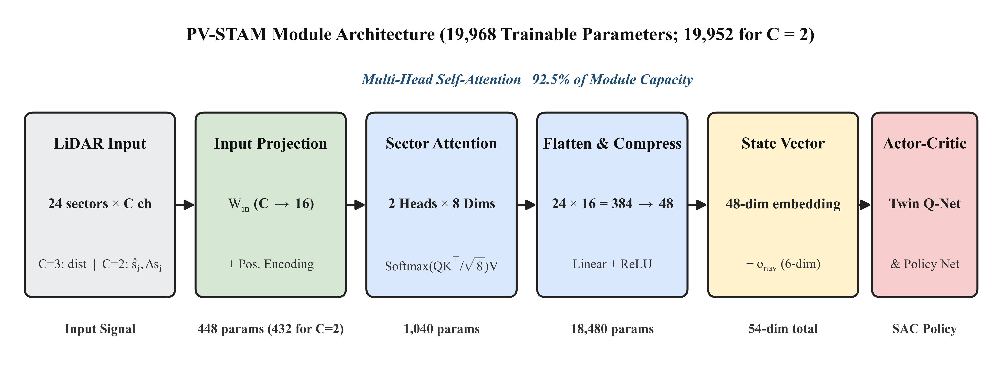
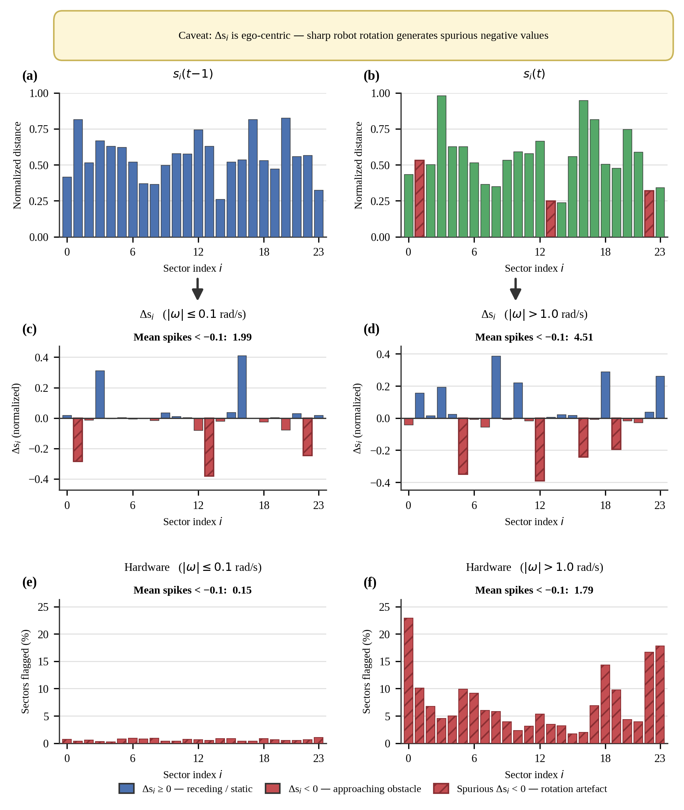
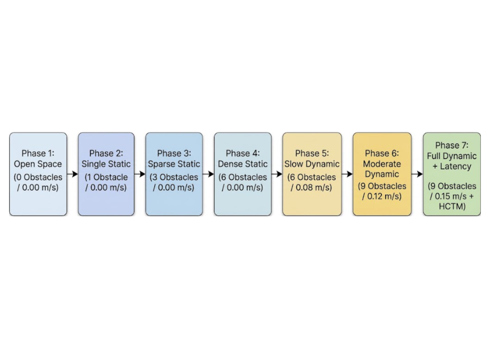
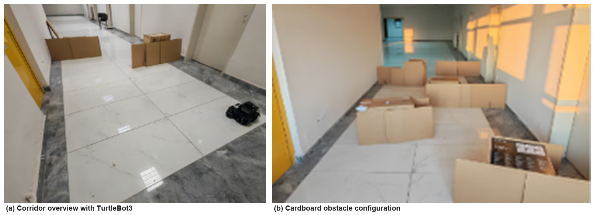
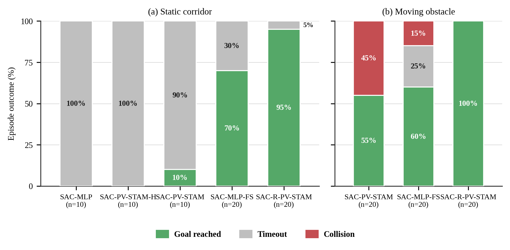

# PV-STAM: Velocity-Aware Attention for Mapless DRL Navigation

Official repository for the research paper:

> **PV-STAM: Velocity-Aware Attention for Mapless Deep Reinforcement Learning Navigation in Dynamic Environments**  
> **Anas Mahyoub Naji Saeed Alqadhi**, Munef El Muhammed, Mohammed Ali M. S. Bajhaw, Aysegul Ucar  
> *Applied Sciences* (MDPI), 2026, 16(18), 9083  
> DOI: [10.3390/app16189083](https://doi.org/10.3390/app16189083) · **RAI Laboratory, Firat University**

---

## Overview

Mapless navigation using 2D LiDAR is fundamentally challenging because a single scan reports obstacle range and bearing, but cannot distinguish whether an obstacle is stationary or actively moving toward the robot. **PV-STAM** (Positional-Velocity Spatio-Temporal Attention Module) is an ultra-compact perception module (**19,968 trainable parameters**, comprising under 3% of total policy capacity) that integrates a per-sector scan-difference channel ($\Delta s_i$) with multi-head self-attention over 24 LiDAR sectors and a linear compression bottleneck ($384 \rightarrow 48$).

<p align="center">
  
  <br/>
  <em>Figure 1: End-to-end system architecture pipeline showing 2D LiDAR sectorization, dual-channel feature extraction, PV-STAM attention processing, and SAC actor-critic policy execution.</em>
</p>

### Key Findings

* **Simulation and Hardware Dissociation:** Across three zero-shot benchmark simulation arenas (Open, Dynamic, Corridor), the three leading temporally-informed variants are statistically indistinguishable (92.0% vs 91.3% vs 88.0% success rate). However, across **130 physical TurtleBot3 trials**, performance diverges significantly: **97.5%** for SAC-R-PV-STAM versus 65.0% for SAC-MLP-FS and 32.5% for SAC-PV-STAM.
* **Rotation Contamination Mitigation:** Evaluated across 27,461 physical scan frames, unmitigated frame-stacking exhibits a **12.0-fold rotation-contamination ratio** during turns ($\omega \ge 0.1\text{ rad/s}$), producing spurious motion signals. Sector attention and per-sector scan-differencing eliminate this artifact without requiring scan registration or odometry fusion.

<p align="center">
  
  <br/>
  <em>Figure 7: Simulation navigation performance across Benchmark A (Open Arena), Benchmark B (Dynamic Obstacles), and Benchmark C (Corridor Arena) with 95% Wilson confidence intervals (pooled n = 300 per variant).</em>
</p>


---

## Module Architecture

<p align="center">
  
  <br/>
  <em>Figure 3: PV-STAM module parameter breakdown (19,968 trainable parameters; 19,952 for C = 2 recurrent variant). Over 92.5% of parameters reside in the linear compression bottleneck.</em>
</p>

### Parameter Breakdown by Layer

| Component / Layer Name | Mathematical Symbol | Tensor Shape | Parameters | Share (%) |
| :--- | :---: | :---: | :---: | :---: |
| **Learned Positional Encoding** | $\mathbf{E}_{\mathrm{pos}}$ | $24 \times 16$ | 384 | 1.9% |
| **Input Projection Weight** | $\mathbf{W}_{\mathrm{in}}$ | $16 \times 3$ | 48 | 0.2% |
| **Input Projection Bias** | $\mathbf{b}_{\mathrm{in}}$ | $16$ | 16 | 0.1% |
| **QKV Self-Attention Projection** | $\mathbf{W}_{QKV}$ | $48 \times 16$ | 768 | 3.8% |
| **Attention Output Weight** | $\mathbf{W}_{\mathrm{out}}$ | $16 \times 16$ | 256 | 1.3% |
| **Attention Output Bias** | $\mathbf{b}_{\mathrm{out}}$ | $16$ | 16 | 0.1% |
| **Linear Compression Weight** | $\mathbf{W}_{\mathrm{comp}}$ | $48 \times 384$ | 18,432 | 92.3% |
| **Linear Compression Bias** | $\mathbf{b}_{\mathrm{comp}}$ | $48$ | 48 | 0.2% |
| **Total PV-STAM Module** | | | **19,968** | **100.0%** |

---

## Rotation Contamination Analysis

<p align="center">
  
  <br/>
  <em>Figure 2: Empirical rotation contamination analysis across 130 physical TurtleBot3 trials, comparing frame-difference signal ratios during pure translation vs rotation.</em>
</p>

---

## Progressive Curriculum

<p align="center">
  
  <br/>
  <em>Figure 4: Flowchart of the progressive 7-phase curriculum advancing agents through static obstacles, dynamic SFM pedestrians, sensor noise, and hardware control latency.</em>
</p>

---

## Physical Hardware Evaluation

<p align="center">
  
  <br/>
  <em>Figure 11: Real-world experimental corridor (3.3 × 7.6 m) setup with TurtleBot3 Waffle Pi evaluating Scenario 2 (static obstacles) and Scenario 3 (moving obstacles).</em>
</p>

### Hardware Evaluation Outcomes (130 Trials)

| Variant | Scenario 2 (Static) | Scenario 3 (Moving) | Overall Standardized Rate | Threshold Violations | Timeouts |
| :--- | :---: | :---: | :---: | :---: | :---: |
| **SAC-R-PV-STAM** | **19 / 20 (95.0%)** | **20 / 20 (100.0%)** | **97.5%** | **0 / 40** | **1** |
| **SAC-MLP-FS** | 14 / 20 (70.0%) | 12 / 20 (60.0%) | 65.0% | 3 / 40 | 11 |
| **SAC-PV-STAM** | 1 / 10 (10.0%) | 11 / 20 (55.0%) | 32.5% | 9 / 30 | 10 |
| **SAC-MLP** | 0 / 10 (0.0%) | 0 / 10 (0.0%) | 0.0% | 0 / 20 | 20 |

<p align="center">
  
  <br/>
  <em>Figure 12: Empirical hardware trial outcome breakdown across 130 physical TurtleBot3 trials in the static corridor (Scenario 2) and moving obstacle (Scenario 3) conditions.</em>
</p>


---

## Repository Structure

```
PV-STAM-mapless-DRL-navigation/
├── data/
│   ├── evaluation/         # 45 canonical benchmark evaluation CSV files (300 episodes/cell)
│   └── hardware/           # 130 physical TurtleBot3 trial arrays (bags.npz) & attention files
├── docs/
│   └── figures/            # High-resolution publication figures & diagrams (Figures 1–12)
├── models/                 # Deployed policy checkpoints for hardware execution
├── scripts/                # Python verification & plotting scripts for Figures 1–12
└── src/
    └── tb3_drl_nav/        # ROS 2 package (environments, controllers, SAC agents)
```

---

## Getting Started

### Prerequisites

```bash
# ROS 2 Humble / Foxy & Gazebo Simulation
sudo apt install ros-${ROS_DISTRO}-turtlebot3* ros-${ROS_DISTRO}-gazebo-ros-pkgs

# Install Python Dependencies
pip install -r requirements.txt
```

### Evaluation and Reproduction

To reproduce all publication figures and tables from the canonical evaluation data:

```bash
# Recompute hardware statistics & Table 13 signatures
python data/hardware/show_results.py

# Re-render publication figures
python scripts/f01_benchmarks.py
python scripts/f08_hardware.py
python scripts/s01_pvstam_module.py
```

---

## Data Availability & Research Collaboration

The canonical benchmark evaluation logs (13,500+ episodes), physical hardware trial arrays (130 real TurtleBot3 runs), trained policy checkpoints, and reproduction scripts are all provided directly within this repository under `data/` and `models/`.

If you require access to full raw training checkpoints across the 7-phase curriculum, complete TensorBoard event histories, raw high-definition video recordings, or wish to explore research collaborations, please contact:

* **Author:** Anas Alqadhi
* **Email:** [anas.m.qd@gmail.com](mailto:anas.m.qd@gmail.com)
* **Affiliation:** RAI Laboratory, Department of Mechatronics Engineering, Firat University

---

## Citation

If you use PV-STAM, our deployed policies, or benchmark datasets in your research, please cite our published paper:

```bibtex
@Article{app16189083,
  author         = {Alqadhi, Anas Mahyoub Naji Saeed and El Muhammed, Munef and Bajhaw, Mohammed Ali M. S. and Ucar, Aysegul},
  title          = {PV-STAM: Velocity-Aware Attention for Mapless Deep Reinforcement Learning Navigation in Dynamic Environments},
  journal        = {Applied Sciences},
  volume         = {16},
  year           = {2026},
  number         = {18},
  article-number = {9083},
  url            = {https://www.mdpi.com/2076-3417/16/18/9083},
  issn           = {2076-3417},
  doi            = {10.3390/app16189083}
}
```

---

## License

This repository is released under the MIT License. See [LICENSE](LICENSE) for details.
